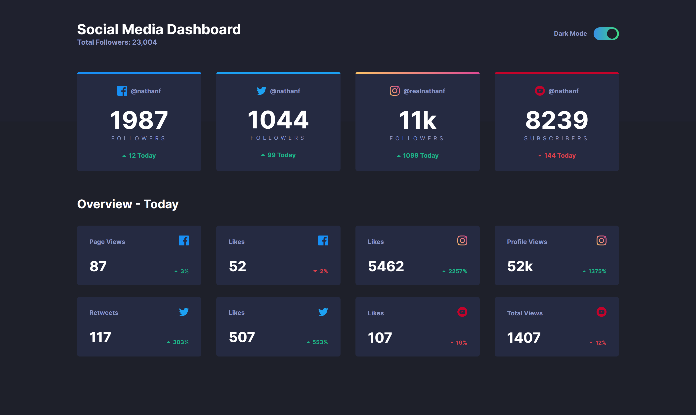
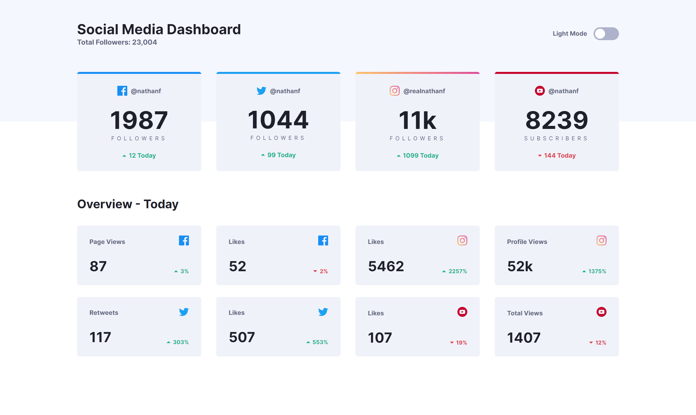
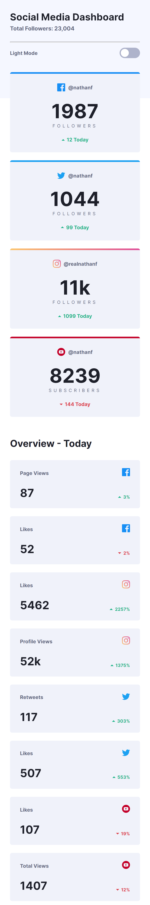

## Overview

### Screenshot

  

    
  

  

    
  

### Links

- Solution URL: (https://github.com/JesnerW/social-media-dashboard)
- Live Site URL: (https://jesnerw.github.io/social-media-dashboard)

## My process

### Built with

- Semantic HTML5 markup
- CSS custom properties
- Flexbox

## Author

- Frontend Mentor - [@JesnerW](https://www.frontendmentor.io/profile/JesnerW)
- Twitter - [@JesnerW](https://twitter.com/JesnerW)
- GitHub - [@JesnerW](https://github.com/JesnerW)
- LinkedIn - [@JesnerW](https://www.linkedin.com/in/jesnerw/)
